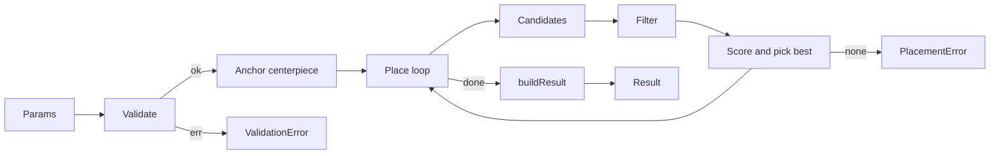
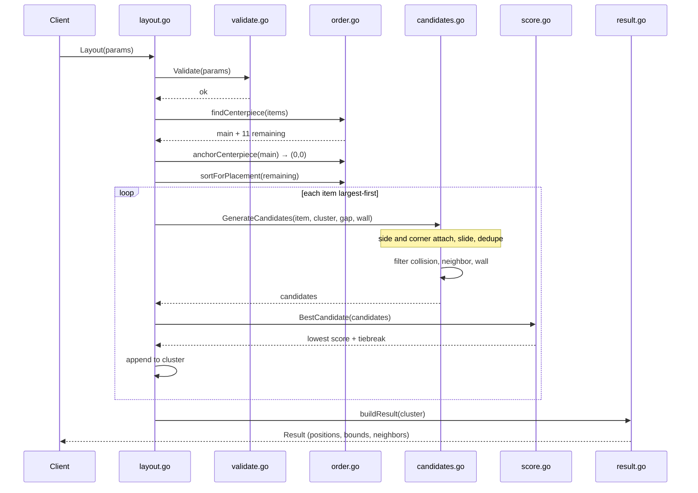
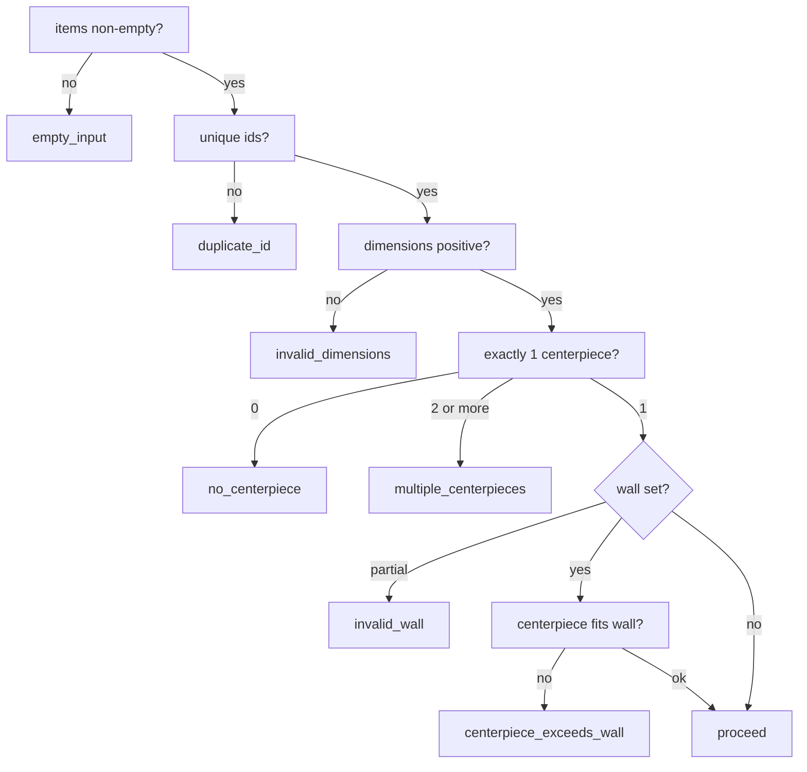
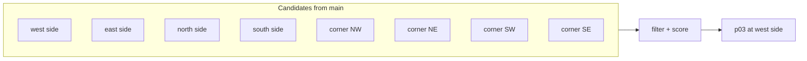
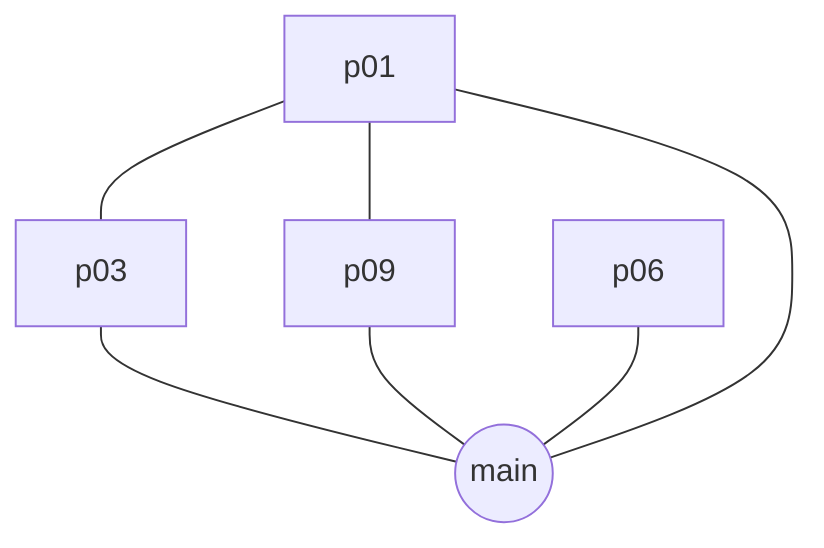
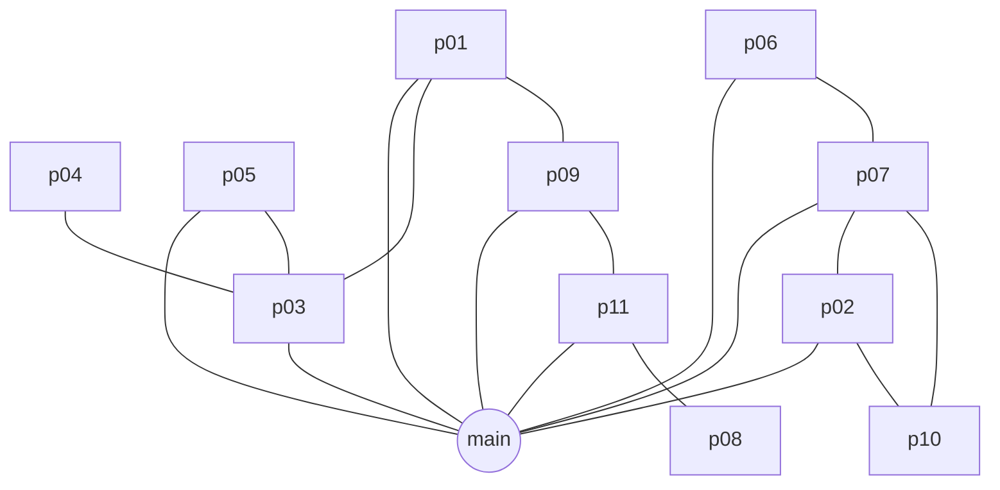
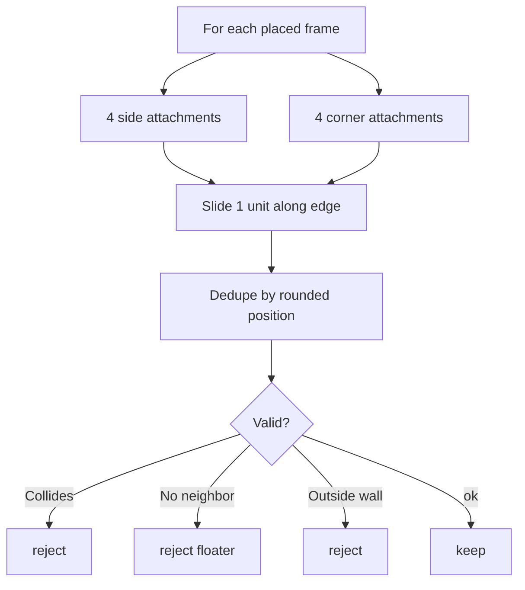
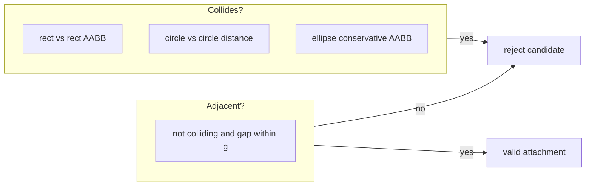
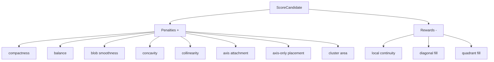
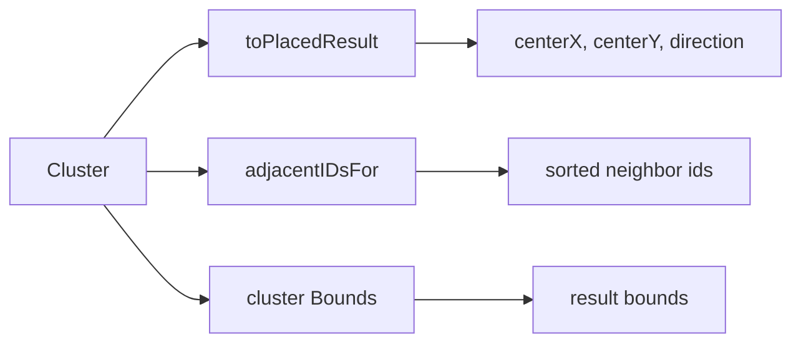

# Layout algorithm

Organic gallery-wall placement: one **centerpiece** at `(0, 0)`, every other frame attaches edge-to-edge (with gap) into a single connected **blob**.

**Entry point:** [`Layout()`](layout.go) · **Spec:** [`docs/DESIGN.md`](../docs/DESIGN.md)

---

## Pipeline



---

## Source map

| Stage        | File                                                | Role                                    |
| ------------ | --------------------------------------------------- | --------------------------------------- |
| Types        | [`types.go`](types.go)                              | `Item`, `Params`, `Shape`               |
| Validate     | [`validate.go`](validate.go)                        | Input + wall checks                     |
| Errors       | [`errors.go`](errors.go)                            | Typed error codes                       |
| Order        | [`order.go`](order.go)                              | Find centerpiece, sort by size          |
| Geometry     | [`geometry.go`](geometry.go)                        | `Footprint`, bboxes, half-extents       |
| Collision    | [`collision.go`](collision.go)                      | Overlap test (shape-aware)              |
| Adjacency    | [`adjacency.go`](adjacency.go)                      | Touching within gap                     |
| Candidates   | [`candidates.go`](candidates.go)                    | Side + corner attachments, 1-unit slide |
| Scoring      | [`score.go`](score.go)                              | Blob heuristics, pick lowest score      |
| Orchestrator | [`layout.go`](layout.go)                            | `Layout`, placement loop, output        |
| Wall         | [`wall.go`](wall.go)                                | Optional bounding box filter            |
| State        | [`placed.go`](placed.go)                            | `PlacedItem`, `Cluster`, `Bounds`       |
| Output       | [`result.go`](result.go) · [`output.go`](output.go) | `Result`, neighbors, direction          |
| Quality      | [`quality.go`](quality.go)                          | Test helpers (aspect, spread, …)        |

---

## Example — 12 paintings

```json
{
  "gap": 2,
  "items": [
    {
      "id": "main",
      "height": 16,
      "width": 14,
      "shape": "rectangle",
      "centerpiece": true
    },
    { "id": "p01", "height": 10, "width": 8, "shape": "rectangle" },
    { "id": "p02", "height": 8, "width": 8, "shape": "square" },
    { "id": "p03", "height": 12, "width": 9, "shape": "rectangle" },
    { "id": "p04", "height": 6, "width": 6, "shape": "circle" },
    { "id": "p05", "height": 9, "width": 7, "shape": "ellipse" },
    { "id": "p06", "height": 11, "width": 8, "shape": "rectangle" },
    { "id": "p07", "height": 7, "width": 10, "shape": "rectangle" },
    { "id": "p08", "height": 8, "width": 6, "shape": "square" },
    { "id": "p09", "height": 10, "width": 10, "shape": "square" },
    { "id": "p10", "height": 5, "width": 7, "shape": "rectangle" },
    { "id": "p11", "height": 9, "width": 6, "shape": "rectangle" }
  ]
}
```

**Result:** 38×40 blob · 11 diagonal placements · centerpiece `main` at origin.

---

## End-to-end sequence



---

## Step 1 — Validate

[`Validate()`](validate.go) · [`validateWall()`](wall.go)



---

## Step 2 — Anchor + sort

[`findCenterpiece()`](order.go) · [`sortForPlacement()`](order.go) · [`anchorCenterpiece()`](order.go)

| Order | ID       | Area | Why first                          |
| ----: | -------- | ---: | ---------------------------------- |
|     — | **main** |  224 | Centerpiece → `(0, 0)` immediately |
|     1 | **p03**  |  108 | Largest satellite                  |
|     2 | **p09**  |  100 |                                    |
|     3 | **p06**  |   88 |                                    |
|     4 | **p01**  |   80 |                                    |
|     5 | **p07**  |   70 |                                    |
|     6 | **p02**  |   64 |                                    |
|     7 | **p05**  |   63 |                                    |
|     8 | **p11**  |   54 |                                    |
|     9 | **p08**  |   48 |                                    |
|    10 | **p04**  |   36 |                                    |
|    11 | **p10**  |   35 | Smallest last — fills gaps         |

Large frames first → compact core; small frames last → tuck into corners.

---

## Step 3 — Placement loop (trace)

Each iteration: **generate → filter → score → append**.

### After centerpiece

```
Cluster: [main @ (0,0)]
```

### Placement 1 — `p03` (12×9)



| Field     | Value       |
| --------- | ----------- |
| Position  | `(-14, -2)` |
| Direction | W           |
| Touches   | main        |

### Placements 2–4 (cluster grows)

|   # | ID  | Position    | Dir | New adjacency  |
| --: | --- | ----------- | --- | -------------- |
|   2 | p09 | `(-2, 15)`  | S   | main           |
|   3 | p06 | `(13, 2)`   | E   | main           |
|   4 | p01 | `(-13, 11)` | SW  | main, p03, p09 |



### Placements 5–11 (corners fill)

|   # | ID  | Position     | Dir |
| --: | --- | ------------ | --- |
|   5 | p07 | `(14, -9)`   | NE  |
|   6 | p02 | `(3, -14)`   | N   |
|   7 | p05 | `(-7, -14)`  | NW  |
|   8 | p11 | `(8, 14)`    | SE  |
|   9 | p08 | `(16, 14)`   | SE  |
|  10 | p04 | `(-16, -13)` | NW  |
|  11 | p10 | `(12, -17)`  | NE  |

Final bounds: **38 × 40** · all 12 connected · no floaters.



---

## Candidate generation

[`GenerateCandidates()`](candidates.go) · [`sideCandidates()`](candidates.go) · [`cornerCandidates()`](candidates.go)



**Attachment offset** uses shape-aware half-extents from [`HalfExtents()`](geometry.go):

| Shape              | Extent                  |
| ------------------ | ----------------------- |
| rectangle / square | half width, half height |
| circle             | radius = min(w,h)/2     |
| ellipse            | semi-axes w/2, h/2      |

Gap `g` is added between extents: `anchor_half + g + item_half`.

---

## Collision & adjacency

[`Collides()`](collision.go) · [`Adjacent()`](adjacency.go)



---

## Scoring

[`ScoreCandidate()`](score.go) · [`BestCandidate()`](score.go)

**Lower score wins.** Rewards (−) pull toward good blobs; penalties (+) push away.



| Signal                   | Intent                              |
| ------------------------ | ----------------------------------- |
| Compactness              | Stay near anchor                    |
| Balance                  | Even mass in quadrants              |
| Blob smoothness          | Wide-round silhouette (~1.4 aspect) |
| Concavity                | Avoid L-shaped bays                 |
| Collinearity             | No horizontal/vertical combs        |
| Diagonal / quadrant fill | Corner blobs, less wasted wall      |
| Local continuity         | Prefer slots touching 2+ neighbors  |

Tiebreak in [`candidateLess()`](score.go): prefer diagonal → spread off flat axis → stable x/y order.

---

## Output

[`buildResult()`](layout.go) · [`toPlacedResult()`](layout.go) · [`adjacentIDsFor()`](output.go)



**Coordinate system:** +X right, +Y down · anchor at centerpiece center.

---

## Optional wall

[`Params.WallWidth / WallHeight`](types.go) · [`footprintFitsWall()`](wall.go)

Wall is a rectangle **centered on anchor**. Candidates whose dimension bbox would cross the edge are filtered out before scoring. Omitted = unbounded.

---

## Errors

| When          | Code                | File                     |
| ------------- | ------------------- | ------------------------ |
| Bad input     | `validation_*`      | [`errors.go`](errors.go) |
| No valid slot | `cannot_place_item` | [`errors.go`](errors.go) |

Use `errors.Is(err, &ValidationError{Code: …})` or [`IsValidationCode()`](errors.go).

---

## Run the example

[`example_test.go`](example_test.go) uses small inline datasets (self-contained runnable docs). Golden regression uses [`testdata/`](testdata/).

```bash
go test ./layout/ -run Example -v
go test ./layout/ -run Golden -v
```

**Visualize** with [`cmd/gallery-svg/`](../cmd/gallery-svg/) — needs a **result** JSON (positions), not params:

```bash
go run ./cmd/gallery-svg/
go run ./cmd/gallery-svg/ \
  layout/testdata/centerpiece_six_mixed_result.json \
  layout/testdata/six_mixed.svg
```
